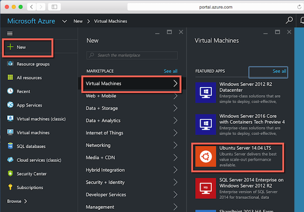
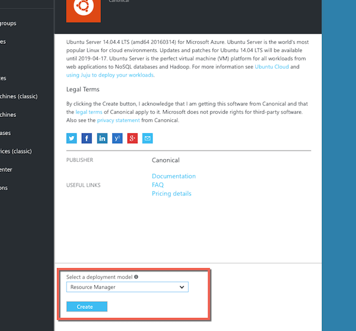
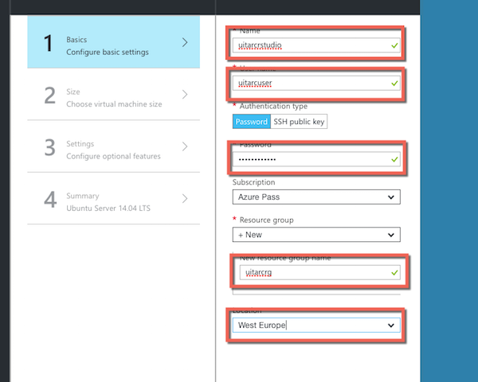

# Practical 1: Creating a Virtual Machine

## Objectives
In this first practical lab, we will:

  * Explore the Azure portal
  * Create a Virtual Machine
  * Install and configure the Hortonworks Sandbox
  * Test it works via a Web browser
  * Confirm access to the Zeppelin Notebook server

### Exercise 1: Creating the VM

Access the Azure portal at: http://portal.azure.com and sign in using the account details you have configured with your promotional code.

To create a Virtual Machine, follow these steps:

1.From the portal, click **[+ NEW]** then choose **Virtual Machines** and then **Ubuntu Server 14.04LTS**:

\ 

2.At the next screen, you will be prompted to choose a deployment model. Select **[Resource Manager]**:

\ 

3.At the next configuration screen, you will need to enter:

  * a suitable name for the VM
  * a username and password to access the VM (make sure you remember these)
  * a resource group name
  * a location data centre for the VM. Choose **West Europe**

\  

4.The following configuration screen will prompt you to select a VM size. For the purposes of this lab just choose the smallest - **DS1 Standard**:

\  

5.The final screen will confirm details and the VM will start to be created. The process usually takes around 5 minutes.

\  

### Exercise 2: Logging in for the first time

After the VM has been created, it will have been given a unique IP address. 

To find this in the portal:

  * Select **All Resources**
  * Choose your VM name
  * The IP address is in the **Public IP address section**

\  

You can now connect to the VM via SSH (Secure Shell) using a client program like PuTTY or MobaXTerm. Enter:

	ssh <username>@<ipaddress>
	
and the password when prompted:

\ 

A successful login will give a screen like this:

\ 

Before moving on to the next section, update the Ubuntu package manager by entering:
	
	sudo apt get update

### Exercise 3: Installing R 

After updating the Ubuntu **apt** package manager, you can now install the R package.

To do this, enter the following instruction:

	sudo apt-get install r-base
	
You will be prompted with a message similar to:

	1 upgraded, 198 newly installed, 0 to remove and 24 not upgraded.
	Need to get 111 MB of archives.
	After this operation, 319 MB of additional disk space will be used.
	Do you want to continue? [Y/n]
	
Answer **Y**

The package manager will then download and install R. The process usually takes 2 or 3 minutes.

To test R has been correctly installed, enter at the keyboard:

	R
	
Yoi should see the normal R text startup screen:

	R version 3.0.2 (2013-09-25) -- "Frisbee Sailing"
	Copyright (C) 2013 The R Foundation for Statistical Computing
	Platform: x86_64-pc-linux-gnu (64-bit)
	
	R is free software and comes with ABSOLUTELY NO WARRANTY.
	You are welcome to redistribute it under certain conditions.
	Type 'license()' or 'licence()' for distribution details.
	
	  Natural language support but running in an English locale
	
	R is a collaborative project with many contributors.
	Type 'contributors()' for more information and
	'citation()' on how to cite R or R packages in publications.
	
	Type 'demo()' for some demos, 'help()' for on-line help, or
	'help.start()' for an HTML browser interface to help.
	Type 'q()' to quit R.
	
	> 
	
At the prompt, enter `q()` to quit.

and at the `Save workspace image? [y/n/c]: ` prompt, enter `n`.

### Exercise 4: Installing RStudio Server

To install RStudio Server, enter these three commands:

	sudo apt-get install gdebi-core
	wget https://download2.rstudio.org/rstudio-server-0.99.896-amd64.deb
	sudo gdebi rstudio-server-0.99.896-amd64.deb
 
If prompted, enter **Y**.

At the end of the installation process, RStudio server will have been installed and the Web server started up.

### Exercise 5: Configuring security access to the Web server

By default, all Web traffic to the VM is blocked for security reasons. In order to access the RStudio Server web interface, you will need to add a **Firewall Rule**.

To do this:

  * Select Virtual Machine
  * Click Resource Group
  * Click All settings
  * Choose the one with a blue shield icon (3rd item)
  * Click All Settings
  * Click Inbound security rules
  * Click the Plus icon on top.

 You will then see a screen like this:
 
 \  

Make sure that the:
  * Name
  * Priority
  * Source Port range
  * Destination Port range

are as shown and then click the **[Allow]** button.

The rule should be created in approximately two minutes.

### Exercise 6: Accessing RStudio server via the Web interface.

Now that the firewall rules have been correctly configured, you should be able to access RStudio via the Web browser using the IP address from earlier.

If your IP address is (for example) `40.68.40.155` then visit address:

`http:\\40.68.40.155:8787`

You will be prompted to enter your username and password:

\  

After which you will be able to use the standard R Studio Server interface.

