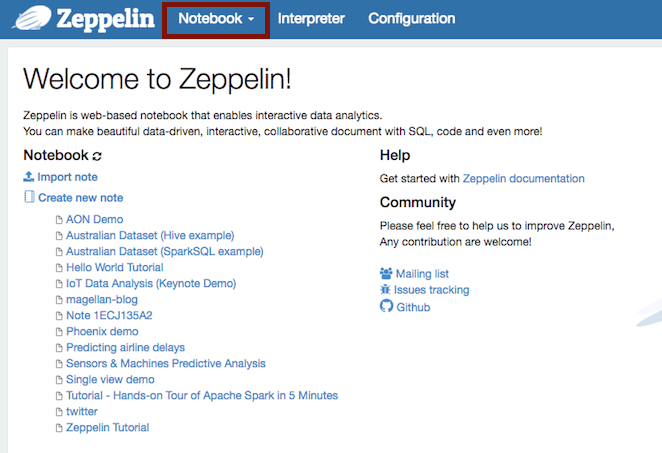
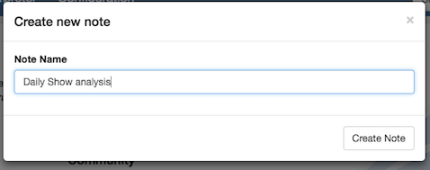
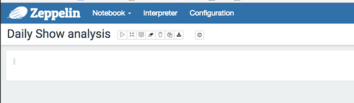
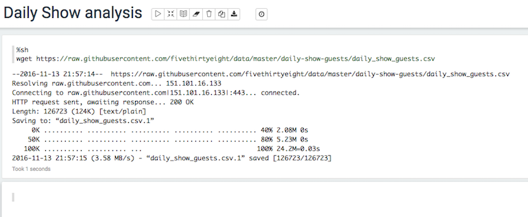

#Using Pyspark to analyse data using Apache Spark

In these exercises, we'll be using some example data from the **Five Thirty Eight** project. 538 publish articles based on the analysis of polling and other data and make many of the datasets they use available for further analysis.

Website: [http://fivethirtyeight.com/](http://fivethirtyeight.com/)

Data repository: [https://github.com/fivethirtyeight/data](https://github.com/fivethirtyeight/data)

In these exercises, we will be using the *Daily Show Guests* dataset, but you can do these exercises with any of the datasets you find useful or interesting.

First, download the `daily_show_guests.csv` file to your PC. Take a look at at and get a feel for the nature of the data it contains.

This should open up in your Spreadsheet application; it's a `csv` comma-separated variable file. This isn't a particularly large dataset, but it's large enough to demonstrate some important principles.

In your HortonWorks instance, launch **Apache Zeppelin**. This provides an online interactive Data Science notebook which uses the Python programming language in the background.

If the IP address of your instance is (for example: `10.123.231.19`, you'll find your notebook at web address:

`http://10.123.231.19:9995`

You should see something like this:

From the Notebook drop-down select *Create new note+* and give the new notebook a suitable name:

You should get a new blank notebook:

##First steps with analysis

We need to get data using the 'Shell' interpreter. This will download the dataset into the Virtual Machine you created earlier:

Enter this code into the first blank section in the notebook.

~~~
%sh
wget https://raw.githubusercontent.com/fivethirtyeight/data/master/daily-show-guests/daily_show_guests.csv
~~~

Like this:

Hit [SHIFT] and [ENTER] and you'll see:

~~~
--2016-11-13 20:01:09--  https://raw.githubusercontent.com/fivethirtyeight/data/master/daily-show-guests/daily_show_guests.csv
Resolving raw.githubusercontent.com... 151.101.60.133
Connecting to raw.githubusercontent.com|151.101.60.133|:443... connected.
HTTP request sent, awaiting response... 200 OK
Length: 126723 (124K) [text/plain]
Saving to: “daily_show_guests.csv.1”
     0K .......... .......... .......... .......... .......... 40% 3.48M 0s
    50K .......... .......... .......... .......... .......... 80% 4.38M 0s
   100K .......... .......... ...                             100% 14.1M=0.03s
2016-11-13 20:01:10 (4.50 MB/s) - “daily_show_guests.csv.1” saved [126723/126723]
FINISHED   
~~~

Spark stores it's data in **Resilient Distributed datasets** (or RDDs for short), but first we need to get the data from the disk into HDFS, the **Hadoop Distributed File System** in our Virtual machine/
 
~~~
%sh
hadoop fs -put ~/daily_show_guests.csv /tmp
~~~

This will `put` the file we have just downloaded into the directort `tmp` within the HDFS.

If you make a mistake during this step or you put the wrong file in the HDFS, you can delete it by:

~~~
%sh
hdfs dfs -rm -r hdfs://sandbox.hortonworks.com/tmp/daily_show_guests.csv
~~~

Next, to create the RDD, we'll be using the *PySpark* Python interpreter, so we'll need to tell the Zeppelin notebook this by prefixing the command with `%pyspark`:

~~~
%pyspark
my_rdd = sc.textFile('hdfs://sandbox.hortonworks.com/tmp/daily_show_guests.csv')
~~~

We refer to the HDFS within this Sandbox as `hdfs://sandbox.hortonworks.com`. It's not a web address.

Let's make sure the data has been loaded into the `RDD` we called `my_rdd` by counting how many lines there are:

~~~
%pyspark
my_rdd = sc.textFile('hdfs://sandbox.hortonworks.com/tmp/daily_show_guests.csv')
my_rdd_filtered = my_rdd.filter( lambda x: len(x) > 0 )
counter = my_rdd_filtered.count()
print (counter)
~~~

It should return `2694` rows.

At this stage, these are just long rows of text and not split into the individual fields. If you recall, the fields are:

Header | Definition
---|---------
`YEAR` | The year the episode aired
`GoogleKnowlege_Occupation` | Their occupation or office, according to Google's Knowledge Graph or, if they're not in there, how Stewart introduced them on the program.
`Show` | Air date of episode. Not unique, as some shows had more than one guest
`Group` | A larger group designation for the occupation. For instance, us senators, us presidents, and former presidents are all under "politicians"
`Raw_Guest_List` | The person or list of people who appeared on the show, according to Wikipedia. The GoogleKnowlege_Occupation only refers to one of them in a given row. 

Take a look at the first 5 rows:

~~~
%pyspark
print (my_rdd.take(5))
~~~

You'll note that the first row is a header row, but this is a bit of a mixed up format. It will make it much easier for us if we can turn each line into a LIST of other items. This will make it more straightforward to handle in Python.

To do this:

~~~
%pyspark
daily_show = my_rdd.map(lambda line: line.split(','))
~~~

and now:

~~~
%pyspark
print (daily_show.take(5))
~~~

will show:

~~~
[[u'YEAR', u'GoogleKnowlege_Occupation', u'Show', u'Group', u'Raw_Guest_List'], [u'1999', u'actor', u'1/11/99', u'Acting', u'Michael J. Fox'], [u'1999', u'Comedian', u'1/12/99', u'Comedy', u'Sandra Bernhard'], [u'1999', u'television actress', u'1/13/99', u'Acting', u'Tracey Ullman'], [u'1999', u'film actress', u'1/14/99', u'Acting', u'Gillian Anderson']]

~~~

Note the [SQUARE BRACKETS] around each line. This is a list. Each line is now a list of strings (Don't worry about the `u`- that just means they are stored in Unicode format).

To recap then, we:

1. Called the RDD function `map()` to specify we want the expression in the brackets to be applied to every line in our dataset 
2. Wrote a **lambda function**fig to split each line using the comma delimiter "," and assigned the resulting RDD to `daily_show`. In Python, a lambda function is just a small self-contained function or expression.
3. Called the RDD function `take()` on `daily_show` to display the first 5 rows of the resulting RDD 

Let's try something a bit more relevant. We need a tally (or simple histogram) of the number of guests each year in our dataset.

First, do this:

~~~
%pyspark
guest_tally = daily_show.map(lambda x: (x[0], 1)).reduceByKey(lambda x,y: x+y)
~~~

This uses both a `map()` and a `reduce()` function to create the tally.

The map part: `.map(lambda x: (x[0], 1))` goes down every row and creates a *tuple* (a key - value pair) consisting of the year and a value 1.

The reduce part: `reduceByKey(lambda x,y: x+y)` combines together all the tuples with the same key using the `x + y` function, ie. it adds them together.

Taking a look at the final results:

~~~
%pyspark
print (guest_tally.take(guest_tally.count()))
~~~

We see the resulting list of key-value pairs:

~~~
[(u'1999', 166), (u'2002', 159), (u'2000', 169), (u'2006', 161), (u'2004', 164), (u'2015', 100), (u'2008', 164), (u'2011', 163), (u'2013', 166), (u'2005', 162), (u'2003', 166), (u'2001', 157), (u'2007', 141), (u'YEAR', 1), (u'2014', 163), (u'2009', 163), (u'2010', 165), (u'2012', 164)]
FINISHED   
~~~

Unfortunately, Spark doesn't know how to handle the column headings so the element `(u'YEAR', 1)` needs to be removed.

Spark has a useful function called `filter` that allows us to create a new RDD from an existing one that contains only the elements we specify. We can create a function in Python that will skip over the line that contains `YEAR`. In the example below we refer to the first element of each line as `line[0]` because Python starts its element numbering at 0. The second element would be `line[1]` etc.

~~~
%pyspark
def filter_out_year(line):
    if line[0] == 'YEAR':
        return False
    else:
        return True
        
cleaned_daily_show = daily_show.filter (lambda line: filter_out_year(line))

print (cleaned_daily_show_tally.take(cleaned_daily_show_tally.count()))

~~~

Will now result in the complete tally of years and numbers of guests per year:

~~~
[(u'1999', 166), (u'2002', 159), (u'2000', 169), (u'2006', 161), (u'2004', 164), (u'2015', 100), (u'2008', 164), (u'2011', 163), (u'2013', 166), (u'2005', 162), (u'2003', 166), (u'2001', 157), (u'2007', 141), (u'2014', 163), (u'2009', 163), (u'2010', 165), (u'2012', 164)]
~~~

##Challenges
###Challenge 1:

In a similar to the worked example above, generate a tally of professions. This is in the `GoogleKnowlege_Occupation` field (the second element in each line, so `line[1]`).

You might find that some of the lines don't have a profession listed, so you will need to skip over them. Python is case sensitive so *politician* and *Politician* are different. How could you handle these?

### Challenge 2:

Count how many times people in the occupation group *Comedy* have appeared on the show. How may times did people in this group appear in 2014?

### Challenge 3:

How many times has Will Ferrell appeared on the show?

As you've seen, **538** host lots of interesting data sets. Choose one or two others and see if you can import and process the dataset to produce some insight. 

